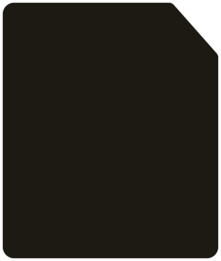

# SVG Verziók Összehasonlítása

## 📊 Áttekintés

| Fájl | preserveAspectRatio | Használat | Torzítás |
|------|---------------------|-----------|----------|
| `card-grey-bg.svg` | nincs (alapértelmezett) | ❌ Ne használd | ❌ Megtartja az arányt |
| `card-grey-bg-stretch.svg` | **none** | ✅ Használd | ✅ Szabadon torzítható |
| `card-bg-black.svg` | nincs (alapértelmezett) | ❌ Ne használd | ❌ Megtartja az arányt |
| `card-bg-black-stretch.svg` | **none** | ✅ Használd | ✅ Szabadon torzítható |

---

## ❌ Eredeti SVG-k (NE használd ezeket!)

### card-grey-bg.svg
```xml
<svg width="536" height="1387" viewBox="0 0 536 1387" fill="none" xmlns="http://www.w3.org/2000/svg">
<!-- Nincs preserveAspectRatio attribútum -->
<!-- Alapértelmezett: xMidYMid meet (megtartja az arányt) -->
```

**Probléma:**
- ❌ Megtartja az eredeti 536:1387 arányt
- ❌ A `background-size: 100% 100%` nem tudja felülírni
- ❌ Nem tölti ki a teljes div-et

### card-bg-black.svg
```xml
<svg id="Layer_1" viewBox="0 0 378.9 446.19" xmlns="http://www.w3.org/2000/svg">
<!-- Nincs preserveAspectRatio attribútum -->
<!-- Alapértelmezett: xMidYMid meet (megtartja az arányt) -->
```

**Probléma:**
- ❌ Megtartja az eredeti 378.9:446.19 arányt
- ❌ Nem torzítható
- ❌ Fehér területek maradnak a div szélein

---

## ✅ Módosított SVG-k (EZEKET használd!)

### card-grey-bg-stretch.svg
```xml
<svg width="536" height="1387" viewBox="0 0 536 1387" preserveAspectRatio="none" fill="none" xmlns="http://www.w3.org/2000/svg">
<!-- preserveAspectRatio="none" hozzáadva -->
```

**Előnyök:**
- ✅ Szabadon alakítható
- ✅ 100%-ra nyúlik szélesség és magasság szerint
- ✅ Kitölti a teljes div-et

### card-bg-black-stretch.svg
```xml
<svg id="Layer_1" viewBox="0 0 378.9 446.19" preserveAspectRatio="none" xmlns="http://www.w3.org/2000/svg">
<!-- preserveAspectRatio="none" hozzáadva -->
```

**Előnyök:**
- ✅ Szabadon alakítható
- ✅ Torzítható az igények szerint
- ✅ Kitölti a teljes div-et

---

## 🔧 Hogyan használd?

### Módszer 1: IMG Tag (Ajánlott)

```html
<div class="training-card">
    
    <!-- Tartalom -->
</div>
```

vagy

```html
<div class="training-card">
    
    <!-- Tartalom -->
</div>
```

### Módszer 2: Background-image CSS-sel

```css
.training-card {
    background-image: url('card-grey-bg-stretch.svg');
    background-size: 100% 100%;
    background-position: center;
    background-repeat: no-repeat;
}
```

**⚠️ Figyelem:** Ez a módszer még mindig lehet, hogy nem működik 100%-ban minden böngészőben. Az **IMG Tag módszer megbízhatóbb**.

---

## 🎨 Mi a különbség vizuálisan?

### Eredeti SVG (megtartja az arányt):
```
┌────────────────────────────┐
│                            │
│  ┌──────────────────────┐  │ ← Fehér területek
│  │                      │  │
│  │   SVG TARTALOM       │  │
│  │   (eredeti arány)    │  │
│  │                      │  │
│  └──────────────────────┘  │
│                            │
└────────────────────────────┘
      DIV konténer
```

### Stretch SVG (kitölti a területet):
```
┌────────────────────────────┐
│                            │
│   SVG TARTALOM             │
│   (nyújtva a teljes        │
│    div méretére)           │
│                            │
└────────────────────────────┘
      DIV konténer
      (teljesen kitöltve)
```

---

## 📐 Technikai Részletek

### Mi az a preserveAspectRatio?

Az SVG `preserveAspectRatio` attribútum határozza meg, hogyan illeszkedjen az SVG a konténerébe.

**Alapértelmezett érték:** `xMidYMid meet`
- Megtartja az eredeti arányt
- Középre igazít
- Nem torzít

**A mi értékünk:** `none`
- **NEM** tartja meg az eredeti arányt
- Kitölti a teljes területet
- Engedélyezi a torzítást

### Példa értékek:

| Érték | Eredmény |
|-------|----------|
| `xMidYMid meet` (alapértelmezett) | Eredeti arány megtartva, lehet fehér terület |
| `xMidYMid slice` | Eredeti arány megtartva, levágja a túlcsordulót |
| **`none`** | **Teljes kitöltés, torzítás engedélyezve** ✅ |

---

## ✅ Ellenőrzési Lista

Mielőtt WordPress-be raknád:

- [ ] Használd a **-stretch.svg** végződésű fájlokat
- [ ] IMG tag módszert használj (ne background-image-t)
- [ ] `object-fit: fill` legyen beállítva
- [ ] `position: absolute` az IMG-n
- [ ] `position: relative` a parent div-en
- [ ] Teszteld különböző képernyőméreteken

---

## 🆘 Hibaelhárítás

### Probléma: Még mindig nem tölti ki a területet

**Ellenőrizd:**
1. Biztosan a **-stretch.svg** fájlt használod?
2. Az IMG tag-en van `object-fit: fill`?
3. A parent div `position: relative`?

**Teszt:**
```javascript
// Böngésző Console (F12)
const img = document.querySelector('.training-card img');
console.log(img.src); // Tartalmaznia kell: "stretch.svg"
console.log(window.getComputedStyle(img).objectFit); // "fill" kell legyen
```

### Probléma: Az SVG fájl nem található (404)

WordPress-ben a helyes útvonal:
```
/wp-content/uploads/card-grey-bg-stretch.svg
/wp-content/uploads/card-bg-black-stretch.svg
```

Vagy ha a témában van:
```
/wp-content/themes/your-theme/card-grey-bg-stretch.svg
```

---

## 📞 Összefoglalás

**DO használd:**
- ✅ `card-grey-bg-stretch.svg`
- ✅ `card-bg-black-stretch.svg`
- ✅ IMG tag + object-fit: fill
- ✅ preserveAspectRatio="none"

**DON'T használd:**
- ❌ `card-grey-bg.svg` (eredeti)
- ❌ `card-bg-black.svg` (eredeti)
- ❌ background-image CSS (nem megbízható)
- ❌ SVG-k implicit aspect ratio-val

---

**Készítette:** Claude AI
**Dátum:** 2024-11-25
**Projekt:** Malik Motoros Tréning
